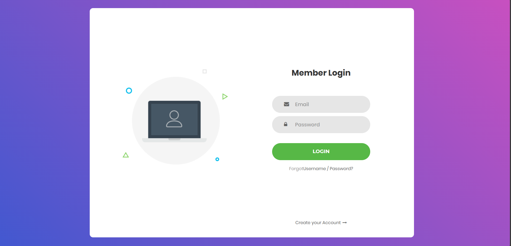

# LOGIN - ZENHOOK


## Project Overview
This project was completed as part of an internship task at a startup company. The task was to implement the backend for a login form in an existing front-end project. The project uses React for the front end and Express with PostgreSQL for the backend.



## Technologies Used
- **Frontend**: React.js
- **Backend**: Node.js, Express.js
- **Database**: PostgreSQL
- **Other Dependencies**:
  - `body-parser`: Middleware for parsing incoming request bodies.
  - `dotenv`: To manage environment variables.
  - `cors`: For enabling cross-origin resource sharing.
  - `bcrypt`: For hashing and encrypting passwords.

## Installation Instructions
1. **Clone the Repository**:
   ```bash
   git clone https://github.com/adesh-111/login-zenhook.git
   cd login-zenhook
   ```

2. **Install Dependencies**:
   ```bash
   npm install
   ```

3. **Set Up Environment Variables**:
   Create a `.env` file in the root of the project and add your PostgreSQL database credentials:
   ```
   PG_USER=yourusername
   PG_HOST=yourhost
   PG_DATABASE=yourdatabase
   PG_PASSWORD=yourpassword
   PG_PORT=yourport
   ```

4. **Start the Server**:
   ```bash
   npm start
   ```

   The server will run on `http://localhost:3000`.

## API Endpoints
- **POST /login**: This endpoint is used to log in users. It accepts `email` and `password` in the request body and stores the hashed password in the database.

## Issues Encountered
- **JavaScript Library Integration**: Faced challenges with integrating certain JavaScript libraries (such as Poppper.js) into the app. This issue has been partially resolved.

## Running the Application
1. **Start the Backend**: 
   ```bash
   npm start
   ```

2. **Start the Frontend**:
   Ensure you are in the React app directory and run:
   ```bash
   npm start
   ```

3. Open `http://localhost:3000` in your browser to see the login form.

## Future Improvements
- Further improve integration of JavaScript libraries.
- Implement additional user authentication features such as password recovery and user registration.

## License
This project is licensed under the MIT License. See the [LICENSE](LICENSE) file for details.

---